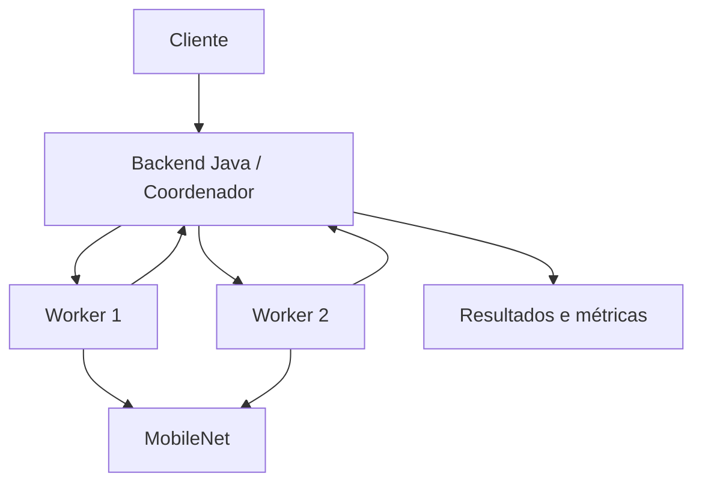

# Classificação Automática de Resíduos Sólidos


Projeto desenvolvido para o **Trabalho Interdisciplinar VI do curso de Ciência da Computação da PUC Minas**.

O conceito do trabalho é classificar imagens de resíduos sólidos e, ao mesmo tempo, estudar como o mesmo processamento se comporta em execuções sequenciais, paralelas e distribuídas.

## O que queremos investigar

A pergunta principal do projeto é: **quanto conseguimos acelerar a classificação de um grande conjunto de imagens sem perder a qualidade das previsões?**

O trabalho junta três áreas estudadas no semestre:

- **Processamento e Análise de Imagens:** preparação das imagens e classificação com uma CNN;
- **Computação Paralela:** processamento em lote, uso de vários núcleos de CPU e, em uma etapa posterior, GPU/CUDA;
- **Computação Distribuída:** divisão dos lotes entre workers independentes e agregação dos resultados por um coordenador.

As seis categorias usadas atualmente são:

`battery` · `glass` · `metal` · `organic` · `paper` · `plastic`

## Estado atual

Neste momento o repositório contém a infraestrutura inicial do projeto:

- backend coordenador em Java com Spring Boot;
- workers de inferência em Python;
- comunicação REST entre coordenador e workers;
- ambiente com dois workers usando Docker Compose;
- script inicial de treinamento com MobileNetV3;
- estrutura preparada para receber o modelo treinado;
- workflow básico de integração contínua.

O modelo treinado **não fica versionado no GitHub**. Sem o arquivo do modelo, a infraestrutura continua funcionando e os endpoints podem ser testados, mas as imagens retornam com o status `MODEL_NOT_LOADED` em vez de uma classificação inventada.

## Arquitetura



O backend recebe um lote de imagens, divide esse lote entre os workers disponíveis e agrega as respostas. Em desenvolvimento local, os dois workers rodam em contêineres diferentes. A mesma configuração pode ser adaptada depois para workers em máquinas diferentes, trocando os endereços configurados no backend.

Mais detalhes estão em [`docs/architecture.md`](docs/architecture.md).

## Requisitos

A forma mais simples de executar o projeto é com Docker. Para isso basta ter:

- Docker;
- Docker Compose.

Para executar as partes separadamente também podem ser usados:

- Java 17 ou superior;
- Maven 3.9 ou superior;
- Python 3.11.

## Rodando com Docker

Na raiz do repositório:

```bash
docker compose up --build
```

Na primeira execução o download das dependências do worker pode demorar alguns minutos, principalmente por causa do PyTorch.

Depois que os serviços iniciarem:

- Backend: `http://localhost:8080`
- Worker 1: `http://localhost:8001`
- Worker 2: `http://localhost:8002`

Teste o backend:

```bash
curl http://localhost:8080/api/v1/health
```

Consulte as categorias:

```bash
curl http://localhost:8080/api/v1/categories
```

Envie uma ou mais imagens:

```bash
curl -X POST http://localhost:8080/api/v1/classifications   -F "files=@exemplo1.jpg"   -F "files=@exemplo2.jpg"
```

Enquanto nenhum modelo estiver disponível em `ml-worker/models/waste_mobilenet.pt`, a resposta informa que o modelo ainda não foi carregado. Isso é intencional.

Para encerrar:

```bash
docker compose down
```

## Treinando um primeiro modelo

O script inicial usa **MobileNetV3 Small com transfer learning**. O dataset não deve ser enviado para o GitHub.

A pasta informada ao script deve seguir esta organização:

```text
Base_unica/
├── battery/
├── glass/
├── metal/
├── organic/
├── paper/
└── plastic/
```

Crie um ambiente virtual e instale as dependências:

```bash
cd ml-worker
python3 -m venv .venv
source .venv/bin/activate
pip install -r requirements.txt
```

Execute o treinamento:

```bash
python training/train.py --data /caminho/para/Base_unica --epochs 10
```

Ao final, o modelo é salvo por padrão em:

```text
ml-worker/models/waste_mobilenet.pt
```

Depois disso, reinicie os workers:

```bash
docker compose restart worker-1 worker-2
```

## Rodando o backend sem Docker

Com os workers já disponíveis nas portas 8001 e 8002:

```bash
cd backend
mvn spring-boot:run
```

Para usar outros workers:

```bash
export WORKER_URLS=http://localhost:8001,http://localhost:8002
mvn spring-boot:run
```

## Estrutura do repositório

```text
.
├── backend/            # coordenador e API principal em Java
├── ml-worker/          # inferência e treinamento do modelo
├── dataset/            # apenas instruções; imagens não são versionadas
├── docs/               # arquitetura, exemplos e referências
├── .github/workflows/  # validações automáticas
├── docker-compose.yml
└── README.md
```

## Métricas previstas

Além da qualidade da classificação, o projeto pretende medir o comportamento computacional das diferentes formas de execução.

**Classificação:** acurácia, precisão, recall, F1-score e matriz de confusão.

**Desempenho:** tempo total, speedup, eficiência, throughput em imagens por segundo, uso de CPU/RAM/VRAM e custo de comunicação entre os workers.

O objetivo é usar sempre o mesmo conjunto de teste e o mesmo modelo para que a comparação entre as configurações seja justa.

## Equipe

- Diego Feitosa Ferreira dos Santos
- Felipe Pereira da Silva
- Kauan Gabriel Silva Pereira
- Mateus Resende Ottoni
- Rikerson Antonio Freitas

## Referências

As referências científicas usadas na proposta estão reunidas em [`docs/references.md`](docs/references.md).

---

O projeto ainda está em desenvolvimento e a arquitetura pode sofrer ajustes conforme os experimentos e as orientações dos professores.
