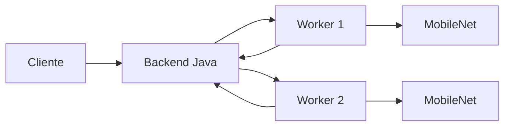

# Arquitetura inicial

A arquitetura foi montada para separar duas responsabilidades que são diferentes no projeto.

O **backend Java** funciona como coordenador. Ele recebe as imagens, divide o lote entre os workers disponíveis, dispara as requisições em paralelo e reúne as respostas.

Os **workers Python** ficam responsáveis pela parte de visão computacional. Essa escolha evita tentar executar PyTorch/CUDA diretamente dentro da aplicação Java e deixa os experimentos com modelos de imagem mais simples de alterar durante o semestre.

## Fluxo distribuído

1. O cliente envia N imagens ao backend.
2. O coordenador divide as imagens em lotes.
3. Cada lote é enviado para um worker por HTTP.
4. Os workers processam os lotes ao mesmo tempo.
5. O coordenador aguarda as respostas e agrega o resultado.
6. O backend calcula tempo total e throughput observado.

## Baseline

O endpoint também permite executar todo o lote em um único worker. Essa execução é útil como primeira referência experimental antes de comparar a versão distribuída.

## Próximas evoluções

- medir CPU, RAM e, quando houver GPU, VRAM;
- controlar batch size de inferência;
- adicionar execução local multicore e CUDA de forma explícita;
- persistir resultados de experimentos;
- executar workers em máquinas diferentes;
- acrescentar repetição de experimentos e exportação para CSV;
- validar speedup e eficiência em cenários comparáveis.
